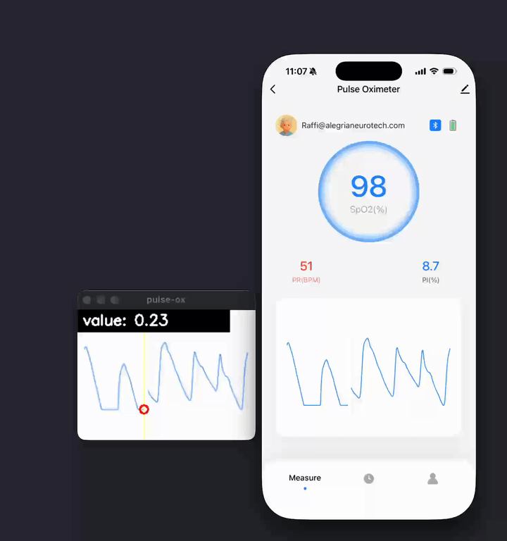

# pulse-ox

Read live values off a sweep-style pulse-oximetry plot on your screen.

Tested with the **Mobi** pulse oximeter app — should work with any plot that
has a moving cursor leaving a trailing colored trace (the default detector
expects a blue trace).



## Run

```sh
uv run main.py
```

1. Drag a rectangle over the plot.
2. A preview window opens showing the captured region with a yellow line
   on the detected sweep cursor and a green dot on the current sample.
   Values stream to the terminal.
3. Press `q` to quit. A matplotlib plot of the full session pops up and a
   `reading_<unix-ts>.png` snapshot is saved.

## Flags

- `--ymin 0 --ymax 100` — calibrate output to real units (default 0–1, bottom→top of region).
- `--fps 60` — capture rate cap (default 30).
- `--region left,top,width,height` — skip the picker and reuse a region.

## How it works

For each captured frame:

1. **Find the sweep cursor.** Diff the current frame against the previous
   one, sum motion energy per column, multiply by a circular Gaussian
   centered at the previous cursor x (so right-edge wraps to left-edge).
   Argmax = current cursor column.
2. **Read the trace.** At that column, find the blue trace pixels and take
   the mean row index.
3. **Convert to value.** Pixel-row → calibrated value via `--ymin`/`--ymax`.

Without inline deps, `pip install -r requirements.txt` works too.

## macOS notes

- Grant **Screen Recording** to your terminal in System Settings → Privacy
  & Security → Screen Recording, then restart the terminal.
- Requires Python 3.12+ with tkinter (uv-managed builds include it).
